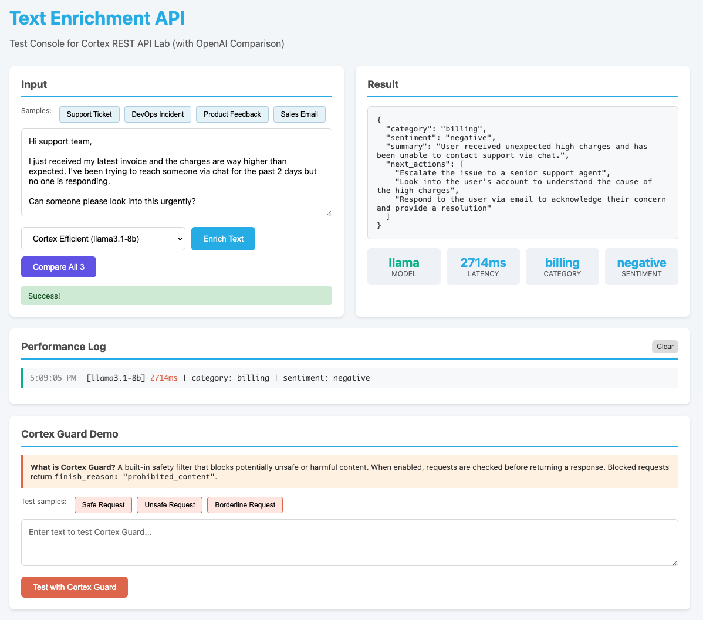

author: Niels ter Keurs
id: text-enrichment-api-endpoint-swap-to-cortex-rest-api
language: en
summary: Swap an existing Text Enrichment API implementation to use Snowflake Cortex REST API as the backend with minimal changes to your client-facing contract.
categories: snowflake-site:taxonomy/product/ai
environments: web
status: Published
feedback link: https://github.com/Snowflake-Labs/sfguides/issues
fork repo link: https://github.com/nielsterkeurs/Text-Enrichment-API---Endpoint-Swap-to-Cortex-REST-API


# Text Enrichment API: Endpoint Swap to Cortex REST API

Build a universal Text Enrichment API that moves LLM inference into Snowflake—without rewriting your product.

## Overview
Duration: 1

This lab is your guide to using **Cortex REST API** as the LLM brain behind your existing apps, by building a universal text enrichment microservice that any startup can drop into their product.

### What You'll Learn

- How to design a normalized JSON enrichment schema (`category`, `sentiment`, `summary`, `next_actions`) that works for tickets, emails, chats, reviews, and logs.
- How to swap an existing OpenAI/Anthropic integration to Cortex REST API with minimal code changes (endpoint, auth, model name).
- How to add model switching, and log latency and token usage so you can reason about quality vs cost.
- (Optional) How to layer in safety guardrails with Cortex Guard for public or user-generated content.

### What You'll Need

- Python 3.9+ ([Download](https://www.python.org/downloads/))
- pip (included with Python)
- A Snowflake account with Cortex REST API enabled
- A user with the `SNOWFLAKE.CORTEX_USER` database role
- Permission to create a Personal Access Token (PAT)
- A REST client for testing (curl on macOS/Linux, PowerShell on Windows, or [Postman](https://www.postman.com/downloads/))

### What You'll Build

- A FastAPI-based text enrichment microservice that accepts free-form text and returns structured JSON (`category`, `sentiment`, `summary`, `next_actions`)
- A swap from OpenAI to Cortex REST API with the same external API contract
- Model tier switching between premium and efficient models with latency/token logging
- (Optional) A Cortex Guard integration for content safety filtering

### Prerequisites

- Familiarity with Python and REST APIs
- A Snowflake account (sign up for a [free trial](https://signup.snowflake.com/) if needed)
- (Optional) An OpenAI API key if you want to run the Phase 1 baseline comparison

### Example Use Cases

- **B2B SaaS support platforms** – classify and summarize inbound tickets, emails, or chat messages before they hit agent queues.
- **DevOps / incident tools** – quick categorization and summaries of error logs, incidents, or on-call messages.
- **Product feedback systems** – enrich NPS responses, app-store reviews, or survey text with sentiment and follow-up suggestions.
- **Sales and customer success** – push enriched summaries, sentiment, and next-step hints into CRMs from emails and meeting notes.
- **Marketplaces / internal ops** – triage free-form user requests into structured categories and actions.

<!-- ------------------------ -->
## Architecture
Duration: 2

```
┌─────────────────┐       POST /enrich        ┌──────────────────────┐
│  Caller (any    │  ──────────────────────►  │  Text Enrichment     │
│  app, webhook,  │                           │  Service (FastAPI)   │
│  CLI, Postman)  │  ◄──────────────────────  │                      │
└─────────────────┘       JSON response       └──────────┬───────────┘
                                                         │
                                                         ▼
                                              ┌──────────────────────┐
                                              │  Cortex REST API     │
                                              │  (Snowflake)         │
                                              └──────────────────────┘
```

**Request:**
```json
{"text": "Customer email or support ticket content here..."}
```

**Response:**
```json
{
  "category": "billing",
  "sentiment": "negative",
  "summary": "Customer received incorrect invoice and support has not responded.",
  "next_actions": ["Review invoice", "Escalate to billing team", "Follow up with customer"]
}
```

<!-- ------------------------ -->
## Connection Setup
Duration: 10

Before running the lab, you need to configure your Snowflake connection. All configuration lives in a `.env` file.

### Step 1: Create the config file

**macOS/Linux:**
```bash
cp .env.example .env
```

**Windows (PowerShell/CMD):**
```cmd
copy .env.example .env
```

### Step 2: Find your Account URL

Your account URL format is: `<orgname>-<accountname>.snowflakecomputing.com`

> ⚠️ **CRITICAL:** Replace any underscores (`_`) with hyphens (`-`) in the account URL!
> 
> Example: `myorg_myaccount` → `myorg-myaccount`
> 
> SSL certificates use hyphens, so underscores will cause certificate errors like:
> `certificate is not valid for 'org_account.snowflakecomputing.com'`

**Option A: From Snowsight URL**

If your Snowsight URL is `https://app.snowflake.com/myorg/myaccount/`, then your account URL is:
```
myorg-myaccount.snowflakecomputing.com
```

**Option B: Run SQL**

```sql
SELECT CURRENT_ORGANIZATION_NAME() || '-' || CURRENT_ACCOUNT_NAME() || '.snowflakecomputing.com';
```

### Step 3: Generate a Personal Access Token (PAT)

**Option A: Using Snowsight UI**

1. Log into [app.snowflake.com](https://app.snowflake.com)
2. Click your name (bottom-left) → **My Profile**
3. Scroll to **Programmatic Access Tokens** → **Generate Token**
4. Name it `cortex_lab_token` and click **Generate**
5. Copy the token immediately—it's only displayed once!

**Option B: Using SQL**

1. Log into [app.snowflake.com](https://app.snowflake.com)
2. Click **Worksheets** in the left sidebar
3. Click **+ Worksheet** to create a new SQL worksheet
4. Paste and run:

```sql
ALTER USER <your_username> ADD PROGRAMMATIC ACCESS TOKEN
  NAME = 'cortex_lab_token'
  COMMENT = 'Token for Cortex REST API lab';
```

**Important:** Copy the token immediately after running—it's only displayed once!

### Step 4: Verify Cortex access

Run this SQL in your Snowsight worksheet to confirm you can use Cortex:

```sql
SELECT SNOWFLAKE.CORTEX.COMPLETE('llama3.1-8b', 'Say hello');
```

If you get a permission error, ask your admin to grant:

```sql
GRANT DATABASE ROLE SNOWFLAKE.CORTEX_USER TO ROLE <your_role>;
```

### Step 5: Update your .env file

```bash
# Your Snowflake account URL (no https:// prefix)
SNOWFLAKE_ACCOUNT_URL=myorg-myaccount.snowflakecomputing.com

# Your PAT
SNOWFLAKE_PAT=your-token-here

# Model tier: "premium" or "efficient"
CORTEX_MODEL_TIER=premium
```

See `.env.example` for all configuration options with detailed comments.

<!-- ------------------------ -->
## Quick Start
Duration: 10

### 1. Clone and setup

```bash
git clone https://github.com/nielsterkeurs/Text-Enrichment-API---Endpoint-Swap-to-Cortex-REST-API.git
cd Text-Enrichment-API---Endpoint-Swap-to-Cortex-REST-API

python -m venv .venv
```

**Activate the virtual environment:**

| Platform | Command |
|----------|---------|
| macOS/Linux | `source .venv/bin/activate` |
| Windows (PowerShell) | `.venv\Scripts\Activate.ps1` |
| Windows (CMD) | `.venv\Scripts\activate.bat` |

> **Note:** You need to activate the virtual environment each time you open a new terminal window. You'll know it's active when you see `(.venv)` at the start of your command prompt.

```bash
pip install -r requirements.txt
```

### 2. Configure connection

Follow the [Connection Setup](#connection-setup) steps above to create your `.env` file.

### 3. Run the Cortex API

```bash
uvicorn app_cortex:app --reload --port 8000
```

> **What is uvicorn?** It's a lightweight web server that runs Python APIs. The `--reload` flag auto-restarts when you edit code (useful for development).
>
> **To stop the server:** Press `Ctrl+C` in the terminal.

### 4. Verify setup

**macOS/Linux:**
```bash
curl http://localhost:8000/health
```

**Windows (PowerShell):**
```powershell
Invoke-RestMethod http://localhost:8000/health
```

**Windows (CMD with curl):**
```cmd
curl http://localhost:8000/health
```

Expected response:
```json
{
  "status": "healthy",
  "default_tier": "premium",
  "premium_model": "claude-3-5-sonnet",
  "efficient_model": "llama3.1-8b",
  "account_configured": true
}
```

### 5. Test the endpoint

**macOS/Linux:**
```bash
curl -X POST http://localhost:8000/enrich \
  -H "Content-Type: application/json" \
  -d '{"text": "Customer says: The last invoice was incorrect and support has not replied for 3 days."}'
```

**Windows (PowerShell):**
```powershell
$body = @{ text = "Customer says: The last invoice was incorrect and support has not replied for 3 days." } | ConvertTo-Json
Invoke-RestMethod -Method Post -Uri http://localhost:8000/enrich -ContentType "application/json" -Body $body
```

**Windows (CMD with curl):**
```cmd
curl -X POST http://localhost:8000/enrich -H "Content-Type: application/json" -d "{\"text\": \"Customer says: The last invoice was incorrect and support has not replied for 3 days.\"}"
```

<!-- ------------------------ -->
## Lab Phases
Duration: 15

### Phase 1: Baseline (Reference Only)

`app_baseline.py` shows a working implementation using OpenAI directly. This is **reference only**—the focus of the lab is the move to Cortex REST API.

```bash
# Optional: Run baseline (requires OPENAI_API_KEY in .env)
uvicorn app_baseline:app --reload --port 8000
```

### Phase 2: Endpoint Swap to Cortex REST API

`app_cortex.py` implements the same `/enrich` contract but calls Cortex REST API:

| Change | From (OpenAI) | To (Cortex REST) |
|--------|---------------|------------------|
| Endpoint | `api.openai.com/v1/chat/completions` | `<account>/api/v2/cortex/inference:complete` |
| Auth | `Bearer $OPENAI_API_KEY` | `Bearer $SNOWFLAKE_PAT` |
| Model | `gpt-4o-mini` | `claude-3-5-sonnet` or `llama3.1-8b` |

**Your external API contract stays exactly the same.**

### Phase 3: Model Tier Switching + Logging

Toggle between models in two ways:

**Option 1: Environment variable (default for all requests)**
```bash
CORTEX_MODEL_TIER=premium    # Higher quality, slower
CORTEX_MODEL_TIER=efficient  # Faster, cheaper
```

**Option 2: Query parameter (per-request override)**
```bash
# Use efficient model for this request only
curl -X POST "http://localhost:8000/enrich?model_tier=efficient" \
  -H "Content-Type: application/json" \
  -d '{"text": "Quick test message"}'
```

Check the console output for performance metrics:
```
[CORTEX] model=claude-3-5-sonnet latency_ms=3500.2 total_tokens=302
[CORTEX] model=llama3.1-8b latency_ms=1800.5 total_tokens=285
```

**Trade-offs:**
- **Premium** – Complex analysis, customer-facing summaries, nuanced sentiment (~3-5s latency)
- **Efficient** – High-volume processing, internal tools, simple categorization (~1-2s latency)

<!-- ------------------------ -->
## Model Comparison: Premium vs Efficient
Duration: 5

One of the key features of Cortex REST API is the ability to **switch models on-the-fly** without changing your application code. This enables rapid experimentation and cost optimization.

### Performance Benchmarks

Tested with the same enrichment prompts across 4 sample payloads:

| Metric | Premium (claude-3-5-sonnet) | Efficient (llama3.1-8b) |
|--------|----------------------------|-------------------------|
| **Avg Latency** | 3.5 - 5.5 seconds | 1.8 - 2.2 seconds |
| **Token Usage** | ~300-330 tokens | ~420-440 tokens |
| **Speed** | Baseline | **~50-60% faster** |

### Quality Observations

**Premium Model (claude-3-5-sonnet):**
- More precise categorization (e.g., "billing" vs generic "support")
- Nuanced sentiment detection (captures mixed feelings accurately)
- Concise, well-structured summaries
- Actionable, specific next steps

**Efficient Model (llama3.1-8b):**
- Good baseline categorization
- Reliable sentiment detection for clear-cut cases
- Slightly more verbose summaries
- More generic action suggestions

### When to Use Each Tier

| Use Case | Recommended Tier | Why |
|----------|------------------|-----|
| Customer-facing responses | Premium | Quality matters for brand perception |
| Internal ticket triage | Efficient | Speed and cost matter more than polish |
| High-volume batch processing | Efficient | Cost scales linearly with volume |
| Complex multi-topic analysis | Premium | Better reasoning for nuanced content |
| Real-time chat enrichment | Efficient | Low latency critical for UX |
| Executive summaries | Premium | Quality justifies the extra latency |

### Why This Matters

With Cortex REST API, you can:

1. **A/B test models** – Compare outputs side-by-side without code changes
2. **Optimize costs** – Route simple requests to efficient models, complex ones to premium
3. **Future-proof** – Swap to new models as Snowflake adds them (no vendor lock-in)
4. **Build adaptive systems** – Dynamically select models based on request characteristics

### Phase 3 (Optional): Cortex Guard

Add content safety checks for public-facing enrichment. Cortex Guard filters potentially unsafe or harmful content before returning responses.

#### How It Works

Enable guardrails by adding a `guardrails` object to your API payload:

```json
{
  "model": "llama3.1-8b",
  "messages": [...],
  "guardrails": {
    "enabled": true,
    "response_when_unsafe": "This request was blocked for safety reasons."
  }
}
```

#### Response When Blocked

When Cortex Guard blocks a request, the response includes:

```json
{
  "choices": [{
    "message": { "content": "This request was blocked for safety reasons." },
    "finish_reason": "prohibited_content"
  }],
  "usage": {
    "prompt_tokens": 45,
    "completion_tokens": 0,
    "guard_tokens": 128,
    "total_tokens": 173
  }
}
```

Key indicators:
- `finish_reason: "prohibited_content"` - Request was blocked
- `guard_tokens` in usage - Shows the overhead of safety checking

#### Try It: `/guard` Endpoint

The lab includes a `/guard` endpoint to test Cortex Guard:

**macOS/Linux:**
```bash
# Safe request (will pass)
curl -X POST http://localhost:8000/guard \
  -H "Content-Type: application/json" \
  -d '{"text": "What is the capital of France?"}'

# Potentially unsafe request (may be blocked)
curl -X POST http://localhost:8000/guard \
  -H "Content-Type: application/json" \
  -d '{"text": "How do I hack into an email account?"}'
```

**Windows (PowerShell):**
```powershell
# Safe request
$body = @{ text = "What is the capital of France?" } | ConvertTo-Json
Invoke-RestMethod -Method Post -Uri http://localhost:8000/guard -ContentType "application/json" -Body $body

# Potentially unsafe request
$body = @{ text = "How do I hack into an email account?" } | ConvertTo-Json
Invoke-RestMethod -Method Post -Uri http://localhost:8000/guard -ContentType "application/json" -Body $body
```

#### Standalone Demo Script

Run the comprehensive Cortex Guard demo:

```bash
# Install dependencies first (if you haven't already)
pip install -r requirements.txt

# Run the demo
python cortex_guard_demo.py
```

This script demonstrates:
- Safe requests (pass through normally)
- Unsafe requests (blocked with `prohibited_content`)
- Token usage comparison with/without guardrails

#### When to Use Cortex Guard

| Use Case | Recommendation |
|----------|----------------|
| User-generated content | **Enable** - Protect against harmful inputs |
| Internal batch processing | Optional - Trust your data sources |
| Customer-facing chatbots | **Enable** - Brand safety matters |
| Trusted API integrations | Optional - Adds latency overhead |

See [Cortex Guard docs](https://docs.snowflake.com/en/user-guide/snowflake-cortex/cortex-guard) for more details.

<!-- ------------------------ -->
## Sample Payloads
Duration: 5

Test with different use cases in the `payloads/` directory:

**macOS/Linux:**
```bash
# Support ticket
curl -X POST http://localhost:8000/enrich \
  -H "Content-Type: application/json" \
  -d @payloads/support_ticket.json

# DevOps incident
curl -X POST http://localhost:8000/enrich \
  -H "Content-Type: application/json" \
  -d @payloads/devops_incident.json

# Product feedback
curl -X POST http://localhost:8000/enrich \
  -H "Content-Type: application/json" \
  -d @payloads/product_feedback.json

# Sales email
curl -X POST http://localhost:8000/enrich \
  -H "Content-Type: application/json" \
  -d @payloads/sales_email.json
```

**Windows (PowerShell):**
```powershell
# Support ticket
$body = Get-Content payloads/support_ticket.json -Raw
Invoke-RestMethod -Method Post -Uri http://localhost:8000/enrich -ContentType "application/json" -Body $body

# DevOps incident
$body = Get-Content payloads/devops_incident.json -Raw
Invoke-RestMethod -Method Post -Uri http://localhost:8000/enrich -ContentType "application/json" -Body $body

# Product feedback
$body = Get-Content payloads/product_feedback.json -Raw
Invoke-RestMethod -Method Post -Uri http://localhost:8000/enrich -ContentType "application/json" -Body $body

# Sales email
$body = Get-Content payloads/sales_email.json -Raw
Invoke-RestMethod -Method Post -Uri http://localhost:8000/enrich -ContentType "application/json" -Body $body
```

<!-- ------------------------ -->
## Repo Structure
Duration: 1

```
├── README.md              # This file (lab instructions)
├── .env.example           # Connection config template (copy to .env)
├── app_baseline.py        # Phase 1: OpenAI reference (optional)
├── app_cortex.py          # Phase 2-3: Cortex REST implementation
├── cortex_guard_demo.py   # Cortex Guard demonstration script
├── test_frontend.html     # Browser-based test UI with Guard demo
├── requirements.txt       # Python dependencies
└── payloads/              # Sample JSON payloads for testing
    ├── support_ticket.json
    ├── devops_incident.json
    ├── product_feedback.json
    ├── sales_email.json
    └── unsafe_request.json  # For testing Cortex Guard
```

<!-- ------------------------ -->
## Optional: Test Frontend
Duration: 5

A browser-based test UI is included for interactive testing and model comparison.

### How to Use

1. **Start the API server** (if not already running):
   ```bash
   uvicorn app_cortex:app --reload --port 8000
   ```

2. **Open the test frontend:**
   - Simply open `test_frontend.html` in your web browser
   - Or use a local server: `python -m http.server 8080` and navigate to `http://localhost:8080/test_frontend.html`

### Features

- **Sample payloads** – Quick-load buttons for support ticket, DevOps incident, product feedback, and sales email
- **Model selection** – Choose between Premium and Efficient tiers (or OpenAI if configured)
- **Compare All 3** – Run the same text through all models side-by-side
- **Performance metrics** – See latency, category, and sentiment at a glance
- **Performance log** – Track all requests with timestamps and metrics
- **Cortex Guard demo** – Test content safety filtering



<!-- ------------------------ -->
## Troubleshooting
Duration: 3

| Error | Cause | Fix |
|-------|-------|-----|
| `SSL certificate error` | Underscores in account URL | Replace `_` with `-` in account URL |
| `JSONDecodeError: Expecting value` | Streaming response | Ensure `"stream": False` in payload (already set in code) |
| `401 Unauthorized` | Invalid or expired PAT | Regenerate PAT, check for typos |
| `403 Forbidden` | Missing Cortex permissions | Grant `SNOWFLAKE.CORTEX_USER` role |
| `429 Too Many Requests` | Rate limited | Reduce frequency, use `efficient` tier |
| `Connection refused` | Wrong account URL | Verify URL format (no `https://` prefix) |
| `Address already in use` | Port 8000 is taken | Use a different port: `uvicorn app_cortex:app --port 8001` |

### Common Windows Workarounds

If the simple `pip` command fails, Windows users often have better luck using the Python Launcher (`py`). This is a small tool installed alongside Python that helps manage different versions.

Try these commands instead:

```powershell
py -m pip install -r requirements.txt
```

or

```powershell
python -m pip install -r requirements.txt
```

Using the `-m` (module) flag is considered a best practice because it ensures you are installing the package for the specific version of Python you are currently calling.

<!-- ------------------------ -->
## Conclusion And Resources
Duration: 2

You already send user text into OpenAI or Anthropic from your backend. In this lab, you kept the same interface for your app, but moved the LLM brain into Snowflake with Cortex REST API. You get Anthropic + open-weight models, Snowflake governance, and multi-model flexibility—without rewriting your app or building a new UI.

### What You Learned

- How to design a normalized JSON enrichment schema that works across tickets, emails, chats, reviews, and logs
- How to swap an OpenAI/Anthropic integration to Cortex REST API with minimal code changes (endpoint, auth, model name)
- How to switch between premium and efficient model tiers and log latency and token usage
- How to add content safety guardrails with Cortex Guard

### Extensions (Advanced)

For participants who finish early:

1. **Bulk enrichment** – Add `/bulk-enrich` endpoint taking an array of texts
2. **Persist to Snowflake** – Write enrichments to a Snowflake table
3. **Domain specialization** – Customize prompts for your startup's domain

### Related Resources

- [Cortex REST API Documentation](https://docs.snowflake.com/en/user-guide/snowflake-cortex/cortex-llm-rest-api)
- [Cortex LLM Functions](https://docs.snowflake.com/en/user-guide/snowflake-cortex/llm-functions)
- [Programmatic Access Tokens](https://docs.snowflake.com/en/user-guide/programmatic-access-tokens)
- [Cortex Guard](https://docs.snowflake.com/en/user-guide/snowflake-cortex/cortex-guard)
